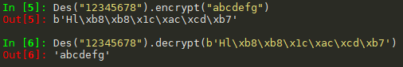
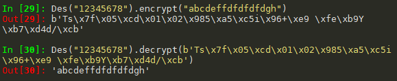

# DES_Py 实验报告

| 键 | 值 | 键 | 值 |
| :------------: | :-------------: | :------------: | :-------------: |
| 年级 | 2016级 | 专业（方向） | 软件工程（计算机应用） |
| 学号 | 15344015 | 姓名 | 洪梓聪 |
| 电话 | 15989995217 | Email | hongzc@mail2.sysu.edu.cn |

## 实验环境

主机：Windows10

编程语言：python

版本：python3

## 算法原理概述

> 算法所需输入

1. 明文分组结构（8个字节即64位）

2. 密钥结构（8个字节即64位，其中8位奇偶校验位）

> 算法输出结果

1. 密文分组结构（8个字节即64位）

> 算法步骤

**加密过程**

1. 初始置换：按照IP置换表进行置换

2. 16轮迭代变换：进行16轮的数据与密钥运算

3. 交换置换：交换高低32位

4. 逆置换：按照逆IP置换表进行置换

**解密过程**

除了第二步的16轮迭代变换的顺序相反，其余过程相同。即加密过程的子密钥按 (K1 K2 … K15 K16) 次序调度，解密过程的子密钥按 (K16 K15 … K2 K1) 次序调度，其中Ki为第i个子密钥。

## 数据结构

|算法结构|代码变量名|
|---|---|
|加密指示|`ENCRYPT = True`|
|解密指示|`DECRYPT = False`|
|S-盒|`__sBoxes`|
|IP置换表|`__IP`|
|逆IP置换表|`__inverseIP`|
|E-扩展表|`__EExpansion`|
|P-置换表|`__PSubstitute`|
|PC-1置换表|`__PC1`|
|PC-2置换表|`__PC2`|
|循环左移表|`__leftRotation`|

## 模块分解

> 通用置换函数：输入table置换表和block原块，输出置换结果。

```py
def __permutate(self, table, block):
    return list(map(lambda x: block[x], table))
```

> 字符串转换位表：将bytes字符串转换成bit表。

```py
def __str2BitList(self, data):
    resultLen = len(data) * 8
    result = [0] * resultLen
    pos = 0
    for ch in data:
        i = 7
        while i >= 0:
            if ch & (1 << i) != 0:
                result[pos] = 1
            else:
                result[pos] = 0
            pos += 1
            i -= 1

    return result
```

> 位表转换字符串：将bit表转换成bytes字符串。

```py
def __bitList2Str(self, data):
    result = []
    pos = 0
    c = 0
    while pos < len(data):
        c += data[pos] << (7 - (pos % 8))
        if (pos % 8) == 7:
            result.append(c)
            c = 0
        pos += 1

    return bytes(result)
```

> 字节填充函数：原始明文消息最后的分组不够8个字节 (64位) 时，在末尾以字节填满，填入的字节取值相同，都是填充的字节数目；原始明文消息刚好分组完全时，在末尾填充8个字节 (即增加一个完整分组)，字节取值都是08。

```py
def __padData(self, data):
    padLen = 8 - (len(data) % 8)
    data += bytes([padLen] * padLen)
    return data
```

> 填充字节还原函数：可以将8字节密文解密后的字符串去掉pad字节。

```py
def __unpadData(self, data):
    padLen = data[-1]
    data = data[:-padLen]
    return data
```

> 生成子秘钥函数：根据给定的64位密钥，生成16个48位的子密钥，供Feistel轮函数调用。

1. 对私钥的56个非校验位进行PC-1置换，得到C0和D0，其中C0和D0分别由置换后的前28位和后28位组成；

2. 计算 Ci = LSi(Ci-1) 和 Di = LSi(Di-1)，当 i =1, 2, 9, 16 时，LSi (A) 表示将二进制串 A 循环左移一个
位置；否则循环左移两个位置；

3. 对 56位的 CiDi 实行 PC-2 压缩置换，得到48位的 Ki，然后令i = i + 1；

4. 如果已经得到 K16，密钥调度过程结束，否则转第二步。

```py
def __createSubKeys(self):
    try:
        self.__key = self.__key.encode()
    except UnicodeEncodeError:
        raise ValueError("Encode error")
    key = self.__permutate(Des.__PC1, self.__str2BitList(self.__key))
    left = key[:28]
    right = key[28:]
    i = 0
    while i < 16:
        j = 0
        while j < Des.__leftRotation[i]:
            left = left[1:] + [left[0]]
            right = right[1:] + [right[0]]
            j += 1
        self.K[i] = self.__permutate(Des.__PC2, left + right)
        i += 1
```

> 加密/解密函数：先按照IP置换表进行置换，接着进行16轮的数据与密钥运算，再交换高低32位，最后按照逆IP置换表进行置换即可。

```py
def crypt(self, data, cryptType):
    result = []
    
    block = self.__str2BitList(data[:])
    block = self.__permutate(Des.__IP, block)
    
    left = block[:32]
    right = block[32:]
    
    if cryptType == Des.ENCRYPT:
        start = 0
        add = 1
    else:
        start = 15
        add = -1
    
    j = 0
    while j < 16:
        tempRight = right[:]
        right = self.__permutate(Des.__EExpansion, right)
        
        right = list(map(lambda x, y: x ^ y, right, self.K[start]))
        B = [right[6 * i:6 * (i + 1)] for i in range(8)]
        
        k = 0
        Bn = [0] * 32
        pos = 0
        while k < 8:
            m = (B[k][0] << 1) + B[k][5]
            n = (B[k][1] << 3) + (B[k][2] << 2) + (B[k][3] << 1) + B[k][4]
            v = Des.__sBoxes[k][m][n]
            
            Bn[pos] = (v & 8) >> 3
            Bn[pos + 1] = (v & 4) >> 2
            Bn[pos + 2] = (v & 2) >> 1
            Bn[pos + 3] = v & 1
            
            pos += 4
            k += 1
            
        right = self.__permutate(Des.__PSubstitute, Bn)
        right = list(map(lambda x, y: x ^ y, left, right))
        left = tempRight
        
        j += 1
        start += add
        
    block = self.__permutate(Des.__inverseIP, right + left)
    result.append(self.__bitList2Str(block))
        
    return bytes.fromhex('').join(result)
```

> 加密函数：首先要对输入的字符串进行encode操作，因为在python3中string和bytes不同，如果要对字符串进行处理，需要先转换成bytes才行，否则，比如对字符串中得某一位加减操作会报错。接着还需要对数据进行padData处理，因为该算法只能加密64位的数据。

```py
def encrypt(self, data):
    try:
        data = data.encode()
    except UnicodeEncodeError:
        raise ValueError("Encode error")
    result = b''
    j = 0
    for i in range(len(data) // 8):
        result += self.crypt(data[8 * i: 8 * (i + 1)], Des.ENCRYPT)
        j = i
    result += self.crypt(self.__padData(data[8 * (j + 1):]), Des.ENCRYPT)
    return result
```

> 解密函数：可以对密文进行解密，但是记得最后的那8个密文解密出来的东西需要去除padData加上的pad

```py
def decrypt(self, data):
    result = ""
    for i in range(len(data) // 8 - 1):
        result += self.crypt(data[8 * i: 8 * (i + 1)], Des.DECRYPT).decode()
    result += self.__unpadData(self.crypt(data[-8:], Des.DECRYPT)).decode()
    return result
```

## 编译运行结果

> Case 1

密钥：12345678

明文：abcdefgh（8个字节）

密文：b'\x94\xd4Ck\xc3\xb5\xb6\x93\xfe\xb9Y\xb7\xd4d/\xcb'


> Case 2

密钥：12345678

明文：abcdefg（7个字节）

密文：b'Hl\xb8\xb8\x1c\xac\xcd\xb7'



> Case 3

密钥：12345678

明文：abcdeffdfdfdfdgh（多个字节）

密文：b'Ts\x7f\x05\xcd\x01\x02\x985\xa5\xc5i\x96+\xe9 \xfe\xb9Y\xb7\xd4d/\xcb'


