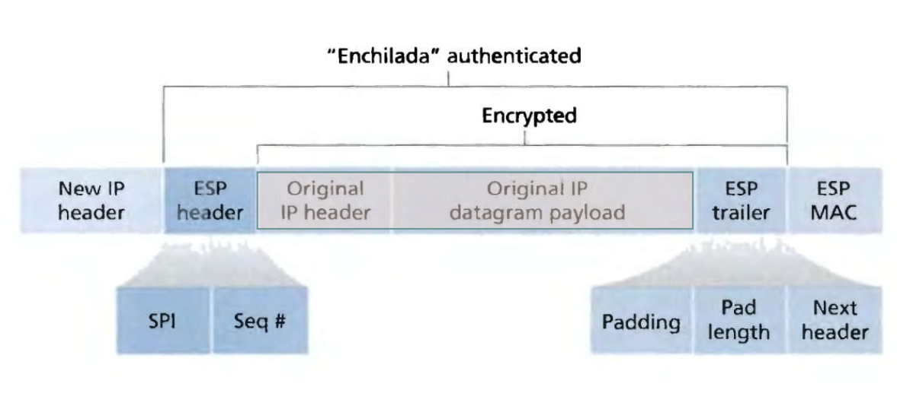
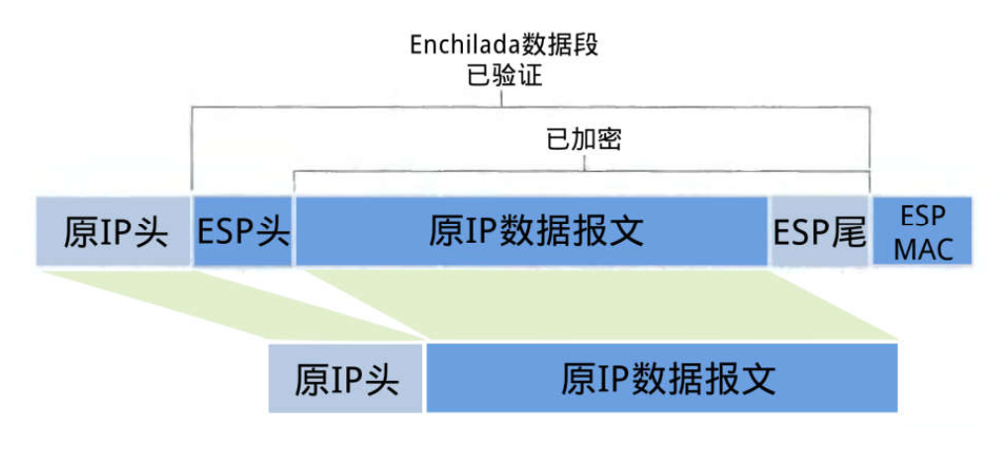

#  IPSec 传输模式下 ESP 报文的装包与拆包过程 实验报告

| 键 | 值 | 键 | 值 |
| :------------: | :-------------: | :------------: | :-------------: |
| 年级 | 2016级 | 专业（方向） | 软件工程（计算机应用） |
| 学号 | 15344015 | 姓名 | 洪梓聪 |
| 电话 | 15989995217 | Email | hongzc@mail2.sysu.edu.cn |

# 简介

ESP (Encapsulating Security Payloads)，封装安全载荷协议，IPsec所支持的两类协议中的一种。该协议能够在数据的传输过程中对数据进行完整性度量，来源认证以及加密，也可以防止回放攻击。

# 隧道模式

## 装包过程

### 步骤 1

在原 IP 报文末尾添加 ESP trailer 信息。

其中 ESP trailer 分为三部分：

- Padding 填充 

- Pad length 填充长度 

- Next header 用来标明被封装的原报文的协议类型

### 步骤 2

将原 IP 报文以及第1步得到的 ESP trailer 作为一个整体进行加密（具体加密算法与密钥由SA给出）封装。

### 步骤 3

为第2步得到的加密数据添加 ESP header。ESP header由 SPI 和 Seq# 两部分组成。

其中 32 位的 SPI 与目的地址和协议组成的三元组可以为IP包确定唯一的 SA，而序列号可用于防止回放攻击

### 步骤 4

附加完整性度量结果 (ICV，Integrity check value)。对第3步得到的 "enchilada" 部分做认证，得到一个32位整数倍的完整性度量值 (MAC)，并附在 ESP 报文的尾部。完整性度量算法包括需要的认证密钥由 SA 给出。

### 步骤 5

加上新的 IP header 构成 IPsec 报文。新构造的 IP header 附在 ESP 报文的前面组成一个新的 IP 报文。协议类型为50，说明它封装的是一个 ESP报文。

注意！！！这个新的 IP header 的 IP 地址由路由器和安全网关解释，可以和原报文 (由主机创建的 IP 地址) 不同。

## 拆包过程

### 步骤 1

接收方收到 IP 报文后，发现协议类型是50，表明这是一个 ESP包。首先查看 ESP header，通过 SPI 决定数据报文所对应的 SA，获得对应的模式 (tunnel/transport mode) 以及安全规范。

### 步骤 2

计算 “enchilada” 部分的摘要，与附在末尾的 ICV 做对比，验证数据完整性。

### 步骤 3

检查 Seq# 里的顺序号，保证数据是“新鲜”的。

### 步骤 4

根据 SA 所提供的加密算法和密钥，解密被加密过的数据，得到原 IP 报文与 ESP trailer。

### 步骤 5

根据 ESP trailer 的填充长度信息，找出填充字段的长度，删去后得到原来的 IP 报文。

### 步骤 6

最后根据得到的原 IP 报文的目的地址进行转发。

# 传输模式

区别在于 IP header 不变（IP类型要变），只对原 IP 数据报文进行加密

# 参考

1. Web 安全课件 PPT 中的 Chap.4.2（主要来自这里）

2. 传输模式下的ESP拆包装包过程

https://wenku.baidu.com/view/d9f4970516fc700abb68fcd3?pcf=2

3. 描述在IPSec传输模式下ESP报文装包和拆包过程

https://blog.csdn.net/tl437002770/article/details/51107399

4. IPSec传输模式/隧道模式下ESP报文的装包与拆包过程

https://www.cnblogs.com/gtarcoder/articles/5745921.html

5. wiki 中 IPSec ESP 词条

https://en.wikipedia.org/wiki/IPsec#Encapsulating_Security_Payload