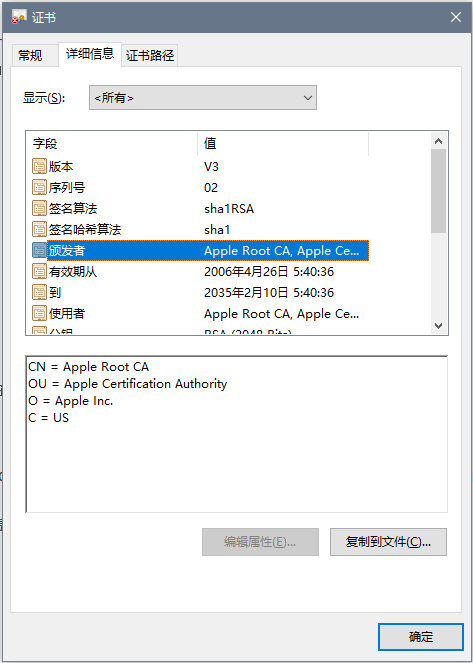
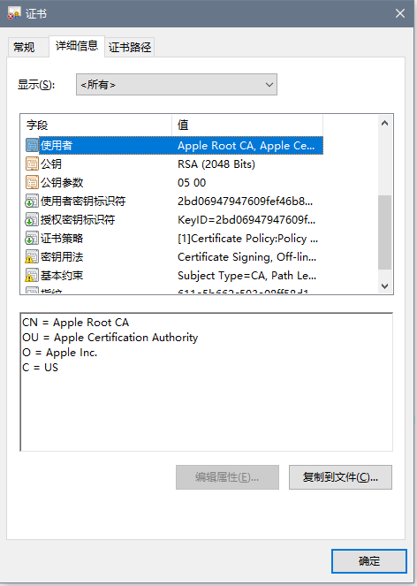

# X.509_Py 实验报告

| 键 | 值 | 键 | 值 |
| :------------: | :-------------: | :------------: | :-------------: |
| 年级 | 2016级 | 专业（方向） | 软件工程（计算机应用） |
| 学号 | 15344015 | 姓名 | 洪梓聪 |
| 电话 | 15989995217 | Email | hongzc@mail2.sysu.edu.cn |

## 实验环境

主机：Windows10

编程语言：python

版本：python3

## 算法原理概述

X.509证书是用 ASN1 语法进行编码的数字证书标准。

## ASN1

ASN1采用一个个的数据块来描述整个数据结构，每个数据块都有四个部分组成：

- 数据块数据类型标识（一个字节），包括简单类型和结构类型。

- 数据块长度（1-128个字节），长度字段，有两种编码格式。

- 数据块的值，存放数据块的值，具体编码随数据块类型不同而不同。

- 数据块结束标识（可选），结束标示字段，两个字节（0x0000）,只有在长度值为不定时才会出现。


在本次 X.509 证书的解码中，我利用了 python 的 asn1 包来进行解析。

## 证书结构

 - Certificate
    - Version
    - Serial Number
    - Algorithm ID
    - Issuer
    - Validity
        - Not Before
        - Not After
    - Subject
    - Subject Public Key Info
        - Public Key Algorithm
        - Subject Public Key
    - Issuer Unique Identifier (Optional)
    - Subject Unique Identifier (Optional)
    - Extensions (Optional)
    - Certificate Signature Algorithm
    - Certificate Signature


## 模块分解

1. 入口函数

```py
if __name__ == '__main__':
    file_name = sys.argv[1]
    with open(file_name, "rb") as file:
        x509process = X509Process(file)
        x509process.process()
```

2. 映射表

```py
tag_id_to_string_map = {
    asn1.Numbers.Boolean: "BOOLEAN",
    asn1.Numbers.Integer: "INTEGER",
    asn1.Numbers.BitString: "BIT STRING",
    asn1.Numbers.OctetString: "OCTET STRING",
    asn1.Numbers.Null: "NULL",
    asn1.Numbers.ObjectIdentifier: "OBJECT",
    asn1.Numbers.PrintableString: "PRINTABLESTRING",
    asn1.Numbers.IA5String: "IA5STRING",
    asn1.Numbers.UTCTime: "UTCTIME",
    asn1.Numbers.Enumerated: "ENUMERATED",
    asn1.Numbers.Sequence: "SEQUENCE",
    asn1.Numbers.Set: "SET"
}

class_id_to_string_map = {
    asn1.Classes.Universal: "U",
    asn1.Classes.Application: "A",
    asn1.Classes.Context: "C",
    asn1.Classes.Private: "P"
}

object_id_to_string_map = {
    "1.3.6.1.5.5.7.1.1": "authorityInfoAccess",

    "2.5.4.3": "commonName",
    "2.5.4.4": "surname",
    "2.5.4.5": "serialNumber",
    "2.5.4.6": "countryName",
    "2.5.4.7": "localityName",
    "2.5.4.8": "stateOrProvinceName",
    "2.5.4.9": "streetAddress",
    "2.5.4.10": "organizationName",
    "2.5.4.11": "organizationalUnitName",
    "2.5.4.12": "title",
    "2.5.4.13": "description",
    "2.5.4.42": "givenName",

    "1.2.840.113549.1.9.1": "emailAddress",

    "2.5.29.14": "X509v3 Subject Key Identifier",
    "2.5.29.15": "X509v3 Key Usage",
    "2.5.29.16": "X509v3 Private Key Usage Period",
    "2.5.29.17": "X509v3 Subject Alternative Name",
    "2.5.29.18": "X509v3 Issuer Alternative Name",
    "2.5.29.19": "X509v3 Basic Constraints",
    "2.5.29.30": "X509v3 Name Constraints",
    "2.5.29.31": "X509v3 CRL Distribution Points",
    "2.5.29.32": "X509v3 Certificate Policies Extension",
    "2.5.29.33": "X509v3 Policy Mappings",
    "2.5.29.35": "X509v3 Authority Key Identifier",
    "2.5.29.36": "X509v3 Policy Constraints",
    "2.5.29.37": "X509v3 Extended Key Usage",

}

algorithm_id_to_string_map = {
    # Algorithm
    '1.2.840.10040.4.1': 'DSA',
    "1.2.840.10040.4.3": "sha1DSA",
    "1.2.840.113549.1.1.1": "RSA",
    "1.2.840.113549.1.1.2": "md2RSA",
    "1.2.840.113549.1.1.3": "md4RSA",
    "1.2.840.113549.1.1.4": "md5RSA",
    "1.2.840.113549.1.1.5": "sha1RSA",
    '1.3.14.3.2.29': 'sha1RSA',
    '1.2.840.113549.1.1.13': 'sha512RSA',
    '1.2.840.113549.1.1.11': 'sha256RSA'
}

version_id_to_string_map = {
    0: 'V1',
    1: 'V2',
    2: 'V3'
}

time_id_to_string_map = {
    0: 'not before: ',
    1: 'not after: '
}
```

3. 解析 tag 为字符串函数

```py
def tag_id_to_string(identifier):
    if identifier in tag_id_to_string_map:
        return tag_id_to_string_map[identifier]
    return '{:#02x}'.format(identifier)
```

4. 解析 class 为字符串函数

```py
def class_id_to_string(identifier):
    if identifier in class_id_to_string_map:
        return class_id_to_string_map[identifier]
    raise ValueError('Illegal class: {:#02x}'.format(identifier))
```

5. 解析 object 为字符串函数

```py
def object_identifier_to_string(identifier):
    if identifier in object_id_to_string_map:
        return object_id_to_string_map[identifier]
    return identifier
```

6. 解析 value 为字符串函数

```py
def value_to_string(tag_number, value):
    if tag_number == asn1.Numbers.ObjectIdentifier:
        return object_identifier_to_string(value)
    elif isinstance(value, bytes):
        return binascii.hexlify(value).upper().decode()
    elif isinstance(value, str):
        return value
    else:
        return repr(value)
```

7. 主函数：其中 count 和 time_count 用来按顺序生成注释，比如 Version, Serial Number, Algorithm 等。

```py
class X509Process:

    def __init__(self, file):
        self.file = file
        self.count = 4
        self.time_count = 2

    def process(self):
        encoded_bytes = file.read()
        decoder = asn1.Decoder()
        decoder.start(encoded_bytes)
        self.print_result(decoder)

    def print_result(self, input_stream, index=0):
        while not input_stream.eof():
            tag = input_stream.peek()
            if tag.typ == asn1.Types.Primitive:
                try:
                    tag, value = input_stream.read()
                except Exception as e:
                    return
                if self.count == 4:
                    print("Version: {}".format(version_id_to_string_map[value]))
                    self.count -= 1
                elif self.count == 3:
                    print("Serial Number: {}".format(value))
                    self.count -= 1
                elif tag_id_to_string(tag.nr) == "OBJECT" and value in algorithm_id_to_string_map:
                    print('Algorithm: {}'.format(algorithm_id_to_string_map[value]))
                elif tag_id_to_string(tag.nr) == "OBJECT" and value_to_string(tag.nr, value) == 'countryName' and self.count == 2:
                    print('Issuer')
                    print('{}: '.format(value_to_string(tag.nr, value)), end='')
                    self.count -= 1
                elif tag_id_to_string(tag.nr) == "OBJECT" and value_to_string(tag.nr, value) == 'countryName' and self.count == 1:
                    print('Subject')
                    print('{}: '.format(value_to_string(tag.nr, value)), end='')
                    self.count -= 1
                elif tag_id_to_string(tag.nr) == "UTCTIME" and self.time_count == 2:
                    time_str = value_to_string(tag.nr, value)
                    print('Validity not before (UTC): 20{}.{}.{} {}:{}:{} '.format(time_str[0:2], time_str[2:4],
                     time_str[4:6], time_str[6:8], time_str[8:10], time_str[10:12]))
                    self.time_count -= 1
                elif tag_id_to_string(tag.nr) == "UTCTIME" and self.time_count == 1:
                    time_str = value_to_string(tag.nr, value)
                    print('Validity not after (UTC): 20{}.{}.{} {}:{}:{} '.format(time_str[0:2], time_str[2:4],
                     time_str[4:6], time_str[6:8], time_str[8:10], time_str[10:12]))
                    self.time_count -= 1
                elif tag_id_to_string(tag.nr) == "OBJECT":
                    print('{}: '.format(value_to_string(tag.nr, value)), end='')
                elif tag_id_to_string(tag.nr) == "PRINTABLESTRING":
                    print(value_to_string(tag.nr, value))
                elif tag_id_to_string(tag.nr) == "NULL":
                    continue
                else:
                    print('{}'.format(value_to_string(tag.nr, value)))
            elif tag.typ == asn1.Types.Constructed:
                input_stream.enter()
                self.print_result(input_stream, index + 2)
                input_stream.leave()
```

## 编译运行结果

输入：`./example/test.cer`

输出：

```
Version: V3
Serial Number: 2
Algorithm: sha1RSA
Issuer
countryName: US
organizationName: Apple Inc.
organizationalUnitName: Apple Certification Authority
commonName: Apple Root CA
Validity not before (UTC): 2006.04.25 21:40:36
Validity not after (UTC): 2035.02.09 21:40:36
Subject
countryName: US
organizationName: Apple Inc.
organizationalUnitName: Apple Certification Authority
commonName: Apple Root CA
Algorithm: RSA
003082010A0282010100E491A9091F91DB1E4750EB05ED5E79842DEB36A2574C55EC8B1989DEF94B6CF507AB223002E8183EF85009D37F41A898F9D1CA669C246B11D0A3BBE41B2AC31F959E7A0CA4478B5BD4163733CBC40F4DCE1469D1C91972F55D0ED57F5F9BF22503BA558F4D5D0DF1643523154B15591DB394F7F69C9ECF50BAC15850678F08B420F7CBAC2C206F70B63F01308CB743CF0F9D3DF32B49281AC8FECEB5B90ED95E1CD6CB3DB53AADF40F0E00920BB121162E74D53C0DDB6216ABA37192475355C1AF2F41B3F8FBE370CDE6A34C457E1F4C6B50964189C474620B10834187338A81B13058EC5A04328C68B38F1DDE6573FF675E65BC49D8769F331465A17794C92D0203010001
X509v3 Key Usage: True
03020106
X509v3 Basic Constraints: True
30030101FF
X509v3 Subject Key Identifier: 04142BD06947947609FEF46B8D2E40A6F7474D7F085E
X509v3 Authority Key Identifier: 301680142BD06947947609FEF46B8D2E40A6F7474D7F085E
X509v3 Certificate Policies Extension: 308201043082010006092A864886F7636405013081F2302A06082B06010505070201161E68747470733A2F2F7777772E6170706C652E636F6D2F6170706C6563612F3081C306082B060105050702023081B61A81B352656C69616E6365206F6E207468697320636572746966696361746520627920616E7920706172747920617373756D657320616363657074616E6365206F6620746865207468656E206170706C696361626C65207374616E64617264207465726D7320616E6420636F6E646974696F6E73206F66207573652C20636572746966696361746520706F6C69637920616E642063657274696669636174696F6E2070726163746963652073746174656D656E74732E
Algorithm: sha1RSA
005C36994C2D78B7ED8C9BDCF3779BF276D277304FC11F8583851B993D4737F2A99B408E2CD4B19012D8BEF4739BEED2640FCB794F34D8A23EF978FF6BC807EC7D39838B5320D338C4B1BF9A4F0A6BFF2BFC59A705097C174056111E74D3B78B233B47A3D56F24E2EBD1B770DF0F45E127CAF16D78EDE7B51717A8DC7E2235CA25D5D90FD66BD4A2242311F7A1AC8F738160C61B5B092F92B2F84448F060389E15F53D2667208A336AF70D82CFDEEBA32FF9536A5B64C0633377F73A072C56EBDA0F210EDABA73194FB5D9367FC18755D9A799B93242FBD8D5719E7EA152B71BBD934224122AC70F1DB64D9C5E63C84B801750AA8AD5DAE4FCD0090737B0757521
```

验证：利用 Window 系统解析





## 参考

1. `test.der` download from:

http://fm4dd.com/openssl/certexamples.htm

2. X.509 数字证书的基本原理及应用

https://zhuanlan.zhihu.com/p/36832100

3. X.509 数字证书结构和实例

https://www.cnblogs.com/chnking/archive/2007/08/28/872104.html