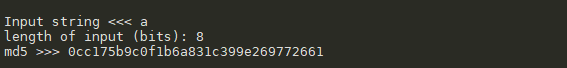
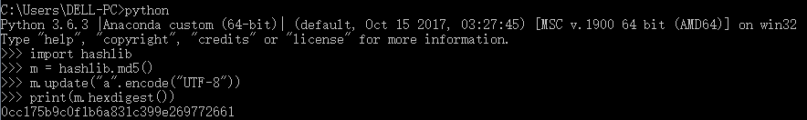
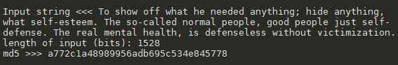
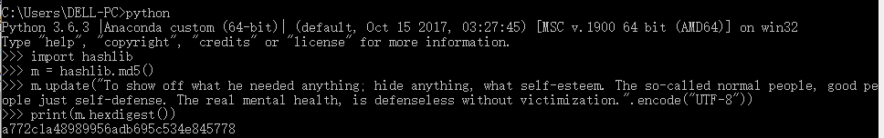

# MD5_Py 实验报告

| 键 | 值 | 键 | 值 |
| :------------: | :-------------: | :------------: | :-------------: |
| 年级 | 2016级 | 专业（方向） | 软件工程（计算机应用） |
| 学号 | 15344015 | 姓名 | 洪梓聪 |
| 电话 | 15989995217 | Email | hongzc@mail2.sysu.edu.cn |

## 实验环境

主机：Windows10

编程语言：python

版本：python3

## 算法原理概述

> 算法所需输入

以 little-endian 形式输入任意长度信息

> 算法输出结果

固定 128-bit 的信息摘要

> 算法步骤

**填充**

1. 在长度为 K bits 的原始消息数据尾部填充长度为 P bits 的标识 100…0，1 <= P <= 512 (即至少要填充1个bit)，使得填充后的消息位
数为：K + P = 448 (mod 512).

2. 再向上述填充好的消息尾部附加 K 值的低64位 (即 K mod 264)，最后得到一个长度位数为 K + P + 64 = 0 (mod 512) 的消息。

**分块**

把填充后的消息结果分割为 L 个 512-bit 分组。

**缓冲区初始化**

初始化一个128-bit 的 MD 缓冲区，记为 CV，表示成 4 个 32-bit 寄存器 (A, B, C, D)。

**循环压缩**

利用 MD5 压缩函数 HMD5：

 - MD5从 CV 输入128位，从消息分组输入512位，完成4轮循环后，输出128位，
用于下一轮输入的 CV 值。

 - 每轮循环分别固定不同的生成函数 F, G, H, I，结合指定的 T 表元素 T[] 和消息分组的不同部分 X[] 做16次迭代运算，生成下一轮循环的输入。

 - 4轮循环总共有64次迭代运算。

**输出结果**

## 数据结构

|算法结构|代码变量名|
|---|---|
|寄存器|`CV`|
|初始向量|`IV = (A,B,C,D)`|
|A|`0x67452301`|
|B|`0xEFCDAB89`|
|C|`0x98BADCFE`|
|D|`0x10325476`|
|生成函数|`F G H I`|

## 模块分解

> 各类参数初始化

```py
# IV
A = '0x67452301'
B = '0xefcdab89'
C = '0x98badcfe'
D = '0x10325476'

# generate function
F = lambda x, y, z: ((x & y) | ((~x) & z))
G = lambda x, y, z: ((x & z) | (y & (~z)))
H = lambda x, y, z: (x ^ y ^ z)
I = lambda x, y, z: (y ^ (x | (~z)))

# used to rotate left shift
RLS = lambda x, n: (((x << n) | (x >> (32 - n))) & 0xffffffff)

s_1 = (7, 12, 17, 22) * 4
s_2 = (5, 9, 14, 20) * 4
s_3 = (4, 11, 16, 23) * 4
s_4 = (6, 10, 15, 21) * 4

m_1 = (0, 1, 2, 3, 4, 5, 6, 7, 8, 9, 10, 11, 12, 13, 14, 15)
m_2 = (1, 6, 11, 0, 5, 10, 15, 4, 9, 14, 3, 8, 13, 2, 7, 12)
m_3 = (5, 8, 11, 14, 1, 4, 7, 10, 13, 0, 3, 6, 9, 12, 15, 2)
m_4 = (0, 7, 14, 5, 12, 3, 10, 1, 8, 15, 6, 13, 4, 11, 2, 9)
```

> 主函数

```py
if __name__ == "__main__":
    while True:
        data = input("Input string <<< ")

        data = list(map(hex, map(ord, data)))
        # every char is 8 bits
        K = len(data) * 8
        print("length of input (bits): %d" % K)

        # padding
        padding_data = data[:]
        padding_data.append('0x80')
        while (len(padding_data) * 8 + 64) % 512 != 0:
            padding_data.append('0x00')

        # make hex value of K greater than or equal to 64 bits('0' is 4 bits in hex)
        K_hex_str = hex(K)[2:].rjust(16, '0')
        # make hex value of K be 64 bits and add '0x'
        K_hex_str = '0x' + K_hex_str[-64:]
        # reverse it and then abort '0x'
        K_hex_str = reverse_hex_str(K_hex_str)[2:]
        K_hex_arr = []
        for i in range(0, len(K_hex_str), 2):
            K_hex_arr.append('0x' + K_hex_str[i:i + 2])
        padding_data.extend(K_hex_arr)

        # little endian
        IV = [A, B, C, D]
        T_i = 1
        CV = IV
        # take every 512 bits
        for i in range(0, len(padding_data) // 64):
            T_i = 1
            CV = H_MD5(CV, padding_data[64 * i: 64 * (i + 1)])
        
        print("md5 >>> " + show_result(CV))
```

> T表生成器

```py
def T(i):
    return (int((1 << 32) * abs(math.sin(i)))) & 0xffffffff
```

> 将十六进制的字符串转成数组

```py
def hex_str2arr(data_str):
    result = []
    for i in range(0, len(data_str), 2):
        result.append(data_str[i: i + 2])
    return result
```

> 将十六进制的字符串倒转（小端和大端互换）

```py
def reverse_hex_str(data_str):
    # abort '0x'
    result = hex_str2arr(data_str)[1:]
    result.reverse()
    result = '0x' + ''.join(result)
    return result
```

> 将 512 bits 的 Y 切分成 16 个 32 bits 的 X 进行下一步处理

```py
def generateX(order, Y):
    # each X is 4 chars
    X = [0] * 16
    for i in range(16):
        X[i] = '0x' + ''.join((Y[4 * order[i]] + Y[4 * order[i] + 1] + Y[4 * order[i] + 2]
                               + Y[4 * order[i] + 3]).split('0x'))
    for i in range(16):
        X[i] = reverse_hex_str(X[i])
    return X
```

> 对 X 分组输入 a，b，c，d 并进行 f 操作，最后根据 s 进行循环移动

```py
def fun(a, b, c, d, f, X, s):
    global T_i
    for i in range(16):
        a = (int(a, 16) + f(int(b, 16), int(c, 16), int(d, 16)) + int(X[i], 16) + T(T_i)) & 0xffffffff
        a = RLS(a, s[i])
        a = hex((int(b, 16) + a) & 0xffffffff)
        a, b, c, d = d, a, b, c
        T_i += 1
    return a, b, c, d
```

> HMD5函数处理

```py
# CV is a array including 4 hex strings
# Y is a array including 64 chars (512 bits)
def H_MD5(CV, Y):

    a, b, c, d = CV

    X_1 = generateX(m_1, Y)
    X_2 = generateX(m_2, Y)
    X_3 = generateX(m_3, Y)
    X_4 = generateX(m_4, Y)

    # four loops
    aa, bb, cc, dd = fun(a, b, c, d, F, X_1, s_1)
    aa, bb, cc, dd = fun(aa, bb, cc, dd, G, X_2, s_2)
    aa, bb, cc, dd = fun(aa, bb, cc, dd, H, X_3, s_3)
    aa, bb, cc, dd = fun(aa, bb, cc, dd, I, X_4, s_4)

    output_a = hex((int(a, 16) + int(aa, 16)) & 0xffffffff)
    output_b = hex((int(b, 16) + int(bb, 16)) & 0xffffffff)
    output_c = hex((int(c, 16) + int(cc, 16)) & 0xffffffff)
    output_d = hex((int(d, 16) + int(dd, 16)) & 0xffffffff)

    return output_a, output_b, output_c, output_d
```

> 显示结果

```py
def show_result(data_list):
    result = ''
    for data_str in data_list:
        result += reverse_hex_str(data_str)[2:]
    return result
```

## 编译运行结果

> Case 1

输入：a

输出：



验证:



> Case 2

输入：To show off what he needed anything; hide anything, what self-esteem. The so-called normal people, good people just self-defense. The real mental health, is defenseless without victimization.

输出：



验证:

